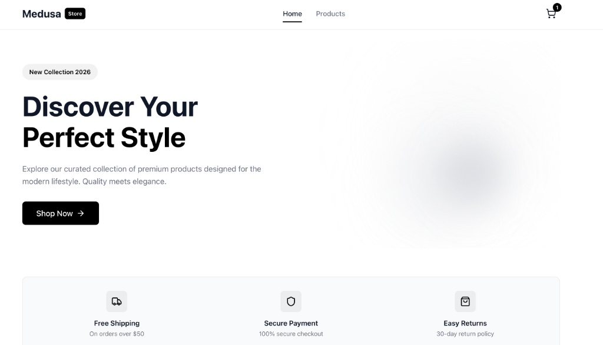

# 🛒 Medusa E-commerce Storefront

A modern, production-grade e-commerce storefront built with **React 18**, **TypeScript**, and **Medusa.js** as the headless commerce backend.



## ✨ Features

- **Product Catalog** - Browse products with responsive grid layout and pagination
- **Product Details** - View product images, descriptions, and variant selection
- **Shopping Cart** - Add/remove items, update quantities, persistent cart state
- **Region Support** - Multi-currency support based on selected region
- **Modern UI** - Clean black & white theme with smooth animations
- **CI/CD** - GitHub Actions for linting, building, and deployment

## 🛠️ Tech Stack

| Layer | Technology |
|-------|------------|
| **Frontend** | React 18, TypeScript, Vite |
| **State Management** | Recoil |
| **Backend** | Medusa.js v2 |
| **Styling** | Vanilla CSS with CSS Variables |
| **Routing** | React Router v7 |
| **Icons** | Lucide React |

## 📁 Project Structure

```
Medusa/
├── backend/          # Medusa.js backend
│   ├── src/
│   ├── .env
│   └── package.json
│
└── frontend/         # React storefront
    ├── src/
    │   ├── components/
    │   │   ├── cart/         # CartItem, CartSummary
    │   │   ├── layout/       # Header, Footer, Layout
    │   │   ├── products/     # ProductCard, ProductGrid
    │   │   └── ui/           # Button, Card, Loading, Price
    │   ├── hooks/            # useProduct, useProducts
    │   ├── pages/            # Home, Products, ProductDetail, Cart
    │   ├── store/            # Recoil atoms (regionState, cartState)
    │   ├── lib/              # Medusa SDK configuration
    │   └── types/            # TypeScript types
    ├── .env
    └── package.json
```

## 🚀 Getting Started

### Prerequisites

- Node.js 20+
- PostgreSQL (for Medusa backend)
- Redis (optional, for caching)

### 1. Backend Setup

```bash
cd backend

# Install dependencies
npm install

# Set up environment variables
cp .env.template .env
# Edit .env with your database credentials

# Run migrations and seed data
npx medusa db:migrate
npx medusa seed --seed-file=src/scripts/seed.ts

# Start the backend
npm run dev
```

The backend will be available at `http://localhost:9000`

### 2. Get Publishable API Key

1. Open Medusa Admin: `http://localhost:9000/app`
2. Navigate to **Settings** → **Developer** → **API Keys**
3. Create a new **Publishable API Key**
4. Copy the key

### 3. Frontend Setup

```bash
cd frontend

# Install dependencies
npm install

# Set up environment variables
cp .env.template .env
```

Edit `.env` with your configuration:
```env
VITE_MEDUSA_BACKEND_URL=http://localhost:9000
VITE_MEDUSA_PUBLISHABLE_KEY=pk_your_key_here
```

Start the frontend:
```bash
npm run dev
```

The storefront will be available at `http://localhost:5173`

### 4. Configure CORS

Update the backend `.env` to allow frontend requests:
```env
STORE_CORS=http://localhost:8000,http://localhost:5173
```

Restart the backend after this change.

## 📦 Available Scripts

### Backend
| Command | Description |
|---------|-------------|
| `npm run dev` | Start development server |
| `npm run build` | Build for production |

### Frontend
| Command | Description |
|---------|-------------|
| `npm run dev` | Start Vite dev server |
| `npm run build` | Build for production |
| `npm run preview` | Preview production build |
| `npm run lint` | Run ESLint |

## 🔧 Environment Variables

### Backend (.env)
| Variable | Description |
|----------|-------------|
| `DATABASE_URL` | PostgreSQL connection string |
| `STORE_CORS` | Allowed origins for Store API |
| `ADMIN_CORS` | Allowed origins for Admin API |
| `JWT_SECRET` | Secret for JWT tokens |
| `COOKIE_SECRET` | Secret for cookies |

### Frontend (.env)
| Variable | Description |
|----------|-------------|
| `VITE_MEDUSA_BACKEND_URL` | Medusa backend URL |
| `VITE_MEDUSA_PUBLISHABLE_KEY` | Publishable API key |

## 🎨 Customization

### Theme
Edit `frontend/src/index.css` to customize the color scheme:
```css
:root {
  --color-primary: #000000;
  --color-background: #ffffff;
  --color-text: #111827;
  /* ... more variables */
}
```

## 📝 License

MIT License

## 🙏 Acknowledgments

- [Medusa.js](https://medusajs.com/) - Open-source headless commerce
- [Vite](https://vitejs.dev/) - Next-generation frontend tooling
- [Recoil](https://recoiljs.org/) - State management for React
